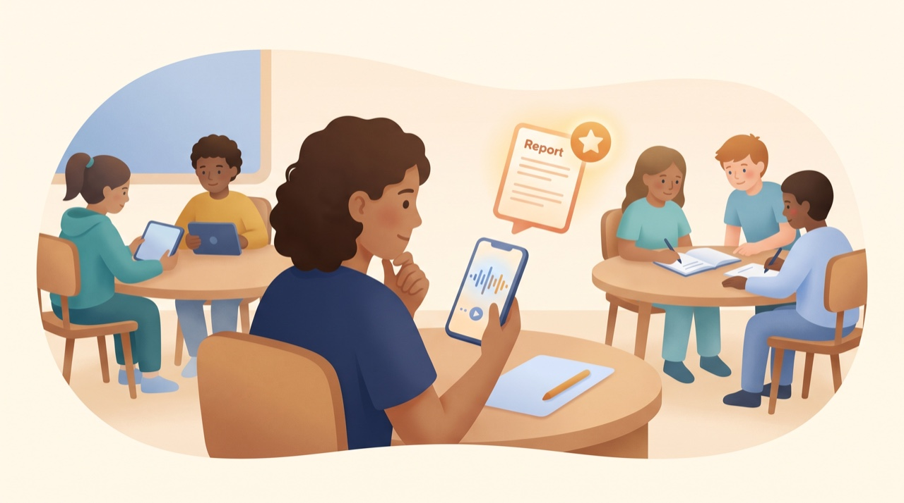
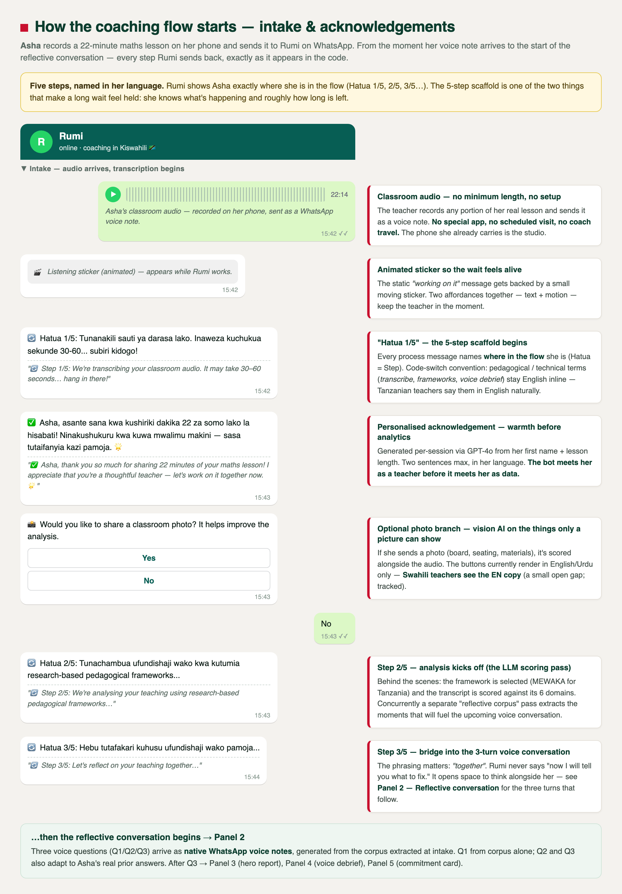
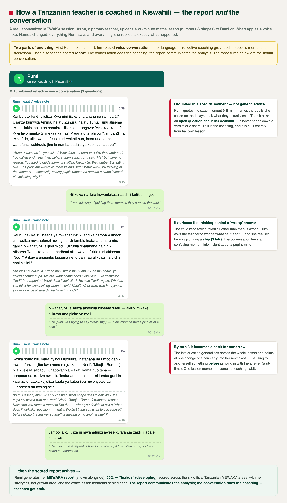
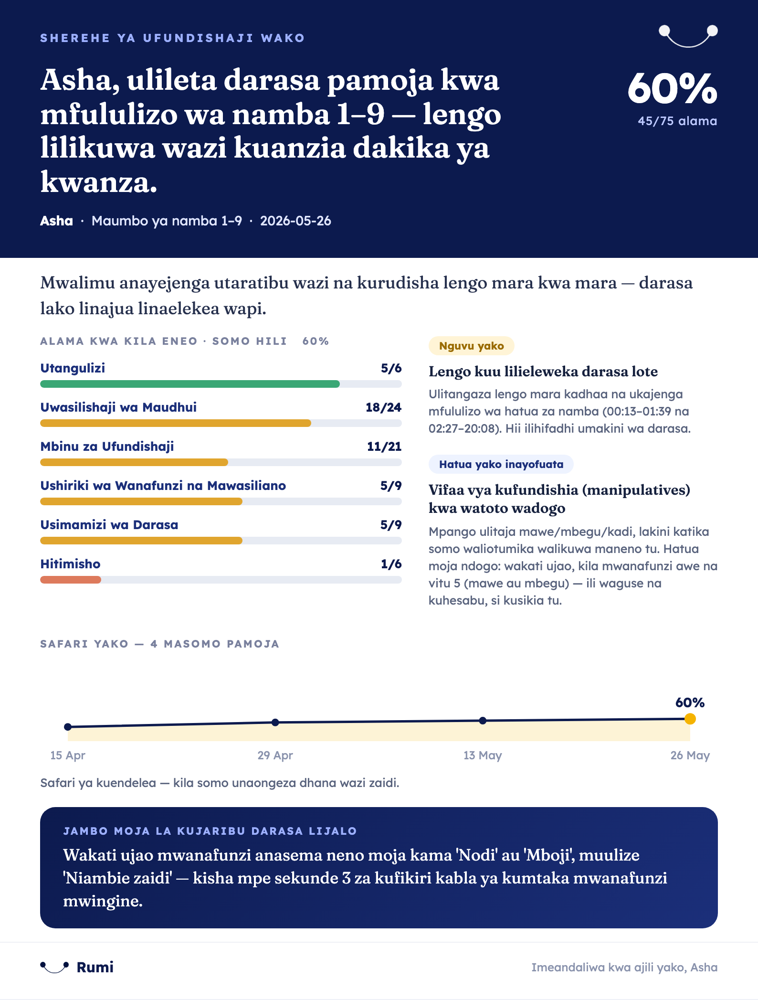
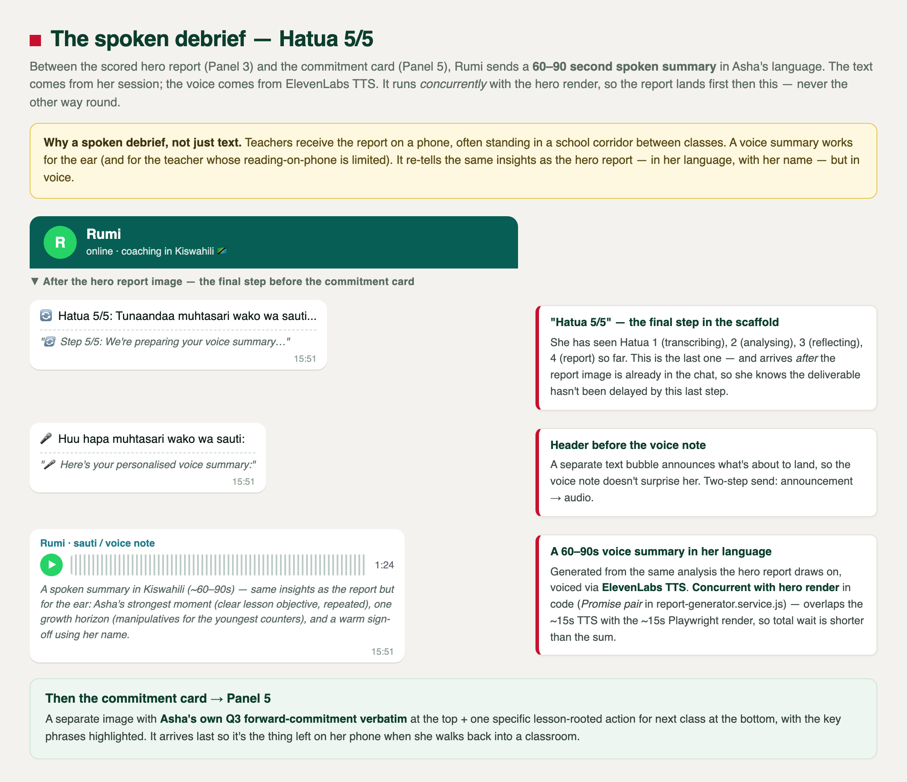
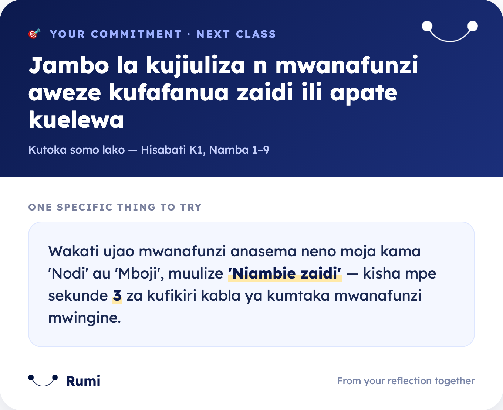

# 🎯 Classroom Coaching

> The best time to coach a teacher is right after they teach. Rumi turns a class **audio recording** into a scored, framework-based coaching report — and a spoken reflective conversation — within minutes.

📄 **See a sample report:** [coaching-report-sample.pdf](../samples/coaching-report-sample.pdf) — the MEWAKA "hero" celebration report (the current shipped design), rendered by the actual pipeline (`node scripts/render-sample-report.js`).

## What it is

A teacher records part of a lesson as **audio** on their phone and sends the voice note to Rumi on WhatsApp. Rumi transcribes it, scores it against a research-backed classroom-observation framework, talks the teacher through a short reflection, and returns a professional PDF report with concrete next steps. No coach, no scheduled visit, no travel — just the phone in their pocket.

## How it works

1. **Teacher records** their classroom as audio and sends the voice note to Rumi. _(Audio only — Rumi does not process classroom video.)_
2. **Rumi transcribes** the recording (Soniox, with Whisper fallback), handling multilingual and code-switched speech.
3. **Rumi scores** the transcript against the teacher's selected framework:
   - **OECD** — the OECD Global Teaching InSights observation framework
   - **HOTS** — a higher-order-thinking classroom-observation tool
   - **TEACH** — the World Bank's TEACH observation tool
   - **FICO** — a domain-based observation framework

   (These four are the selectable scoring frameworks, registered in `framework-registry.js`.) The OSS bot also includes a **MEWAKA** report path (a Tanzania teacher-CPD format) — when a session's framework is `mewaka`, the report is rendered by a dedicated transformer + template (`pdf-report.service.js`, `framework === 'mewaka'`).
4. **Optional classroom photo analysis** — if the teacher also sends a photo, Rumi uses vision AI to score things only a picture can show (seating, materials, board use).
5. **Reflective conversation** — Rumi asks a few voice-delivered questions that prompt the teacher to think about specific moments in their own lesson.
6. **PDF report** — scores per goal, evidence quoted from the transcript, growth areas, prioritised recommendations, and charts. It ends with a coaching card naming the single highest-leverage next action.
7. **Progress over time** — each session remembers the last one, so feedback builds instead of repeating.

## What the teacher experiences

The coaching flow has **five named steps** (Step 1/5 → 5/5), all surfaced to the teacher in her language as the work happens. The tone is supportive, never punitive.

### End-to-end walkthrough — what an adopter's teacher actually receives

A real, anonymized Tanzanian session in Kiswahili (teacher renamed **Asha**, students renamed too). Below: every panel in the flow, with the bot's verbatim messages and English glosses.

**Panel 1 — Intake & acknowledgements** (Step 1/5 → 3/5). Asha records ~22 minutes of her maths lesson and sends it as a voice note. Rumi acknowledges, shows an animated listening sticker, kicks off transcription (`🔄 Hatua 1/5: Tunanakili sauti ya darasa lako…`), sends a per-session personalised acknowledgement (GPT-4o, uses her name + lesson length), offers an optional classroom-photo branch, then moves to analysis (`🔄 Hatua 2/5: Tunachambua ufundishaji wako…`) and to the reflection bridge (`🔄 Hatua 3/5: Hebu tutafakari kuhusu ufundishaji wako pamoja…`).

**Panel 2 — Reflective voice conversation** (Step 3/5 continued). Three questions arrive as **native WhatsApp voice notes** generated by ElevenLabs TTS. Q1 is built from a "reflective corpus" extracted at intake; Q2 and Q3 also adapt to Asha's real prior answers. After Q3 she gets a thank-you (`Asante kwa tafakari zako za kina! 🙏`).

**Panel 3 — Hero report** (Step 4/5: `🔄 Hatua 4/5: Tunaandaa ripoti yako kamili ya uchunguzi…`). The scored single-page A4 celebration design lands as an inline WhatsApp **image with caption** (not a PDF document). Header score · per-domain bars · "Your strength" + "Your next horizon" · the cross-session journey trend · the one thing to try next class. Caption: `📋 Ripoti yako ya ufundishaji · Maumbo ya namba 1–9 · 2026-05-26`.

**Panel 4 — Voice debrief** (Step 5/5: `🔄 Hatua 5/5: Tunaandaa muhtasari wako wa sauti…` followed by `🎤 Huu hapa muhtasari wako wa sauti:` and then the audio). A 60–90 second spoken summary of the same insights, voiced via ElevenLabs TTS. Runs *concurrently* with the hero render so the report image lands first, then this — never the other way round.

**Panel 5 — Commitment card**. A separate image arrives last with **Asha's own Q3 forward-commitment verbatim** at the top + one specific lesson-rooted action for next class at the bottom, with the key phrases highlighted. Last thing on her phone when she walks back into a classroom.

These five panels are the live shipped Tanzanian (MEWAKA) experience, captured exactly as the bot sends them (verbatim Kiswahili from `coaching-strings.js`, Q1/Q2/Q3 from a real anonymised session). Follow-up PRs make the hero + the post-observation commitment card the **default for every framework**, not just MEWAKA — so OECD/HOTS/TEACH/FICO adopters get the same celebration design rendered against their framework's own scorecard.

## Enable it

Set **`SONIOX_API_KEY`** (transcription). For spoken reflective questions, also set `ELEVENLABS_API_KEY`. The framework is chosen per teacher and stored on their profile.

## Customize

Swap or add frameworks, change scoring rubrics, or adjust the reflection style — see [Agent Customization §1](../agent-customization.md#1-swap-the-coaching-framework).
